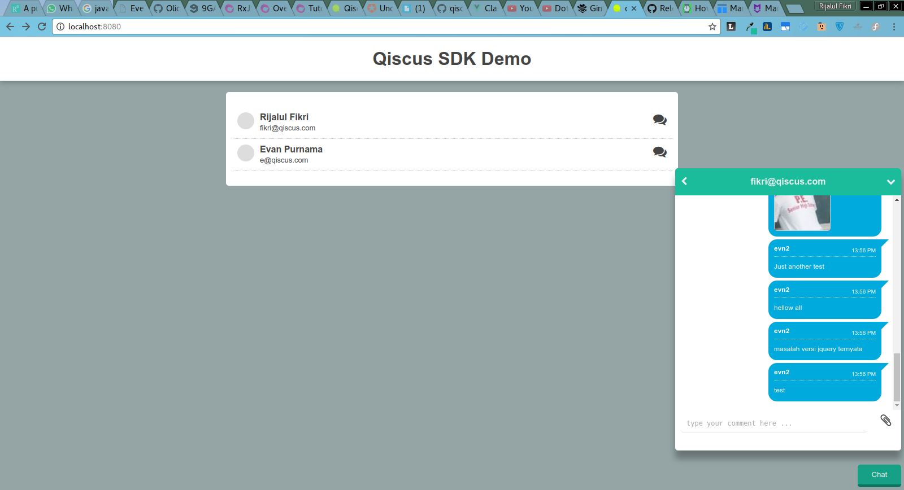

# qiscus-sdk-web

> Qiscus Javascript SDK For Web

**qis**cus SDK helps you build Web Chat Application easy and fast. It uses **qis**cus server backend for the API.

# Installation and Usage

You need to include the javascript and css files from the build directory. And you also need to append `<div id="qiscus-widget"></div>` tag before closing body tag.

``` html
<!DOCTYPE html>
<html lang="en">
<head>
  <meta charset="UTF-8">
  <title>Document</title>
  <link rel="stylesheet" type="text/css" href="path/to/css/qiscus-sdk.css"> 
</head>
<body>
  <div id="qiscus-widget"></div>
  <script src="path/to/js/qiscus-sdk.js"></script>
  <script>
     qiscus.setUser('your@email.com', 'key', 'username');
     qiscus.init({AppId: 'dragonfly'});
  </script>
</body>
</html>
```

The javascript file introduce a new global variable called `qiscus`. We'll use that to initiate our chat widget.

``` javascript
// Set Current User for the Chat Widget
qiscus.setUser('email@email.com', 'key', 'username');
// Init the widget
qiscus.init({AppId: 'dragonfly'});
```

You can get `AppId` by requesting one from [sdk.qiscus.com](http://sdk.qiscus.com)

# Init Options
There are various options you can pass to init method. They are:

| option              	| required 	| description                                                                                                                                                                                      	|
|---------------------	|----------	|--------------------------------------------------------------------------------------------------------------------------------------------------------------------------------------------------	|
| AppId               	| true     	| You can get this ID by contacting qiscus, this will be use to differentiate company or user using qiscus sdk                                                                                     	|
| newMessagesCallBack 	| false    	| You can pass callback that will be run whenever there's incoming new message. It only accept one parameter `function newMessagesCallBack ( data ) {    console.log('incoming data', data); } ` 	  |



# API
This version of sdk also include the `view layer` which is written in `vuejs` and using `vuex` for the `state management`. 
We're being introduced one more global object called `vStore` to access this view layer so you can chat different target.
Here are methods you can access through this `vStore` object. 

| option              	| how to use 	| description                                                                                                                                                                                      	|
|---------------------	|----------	|----------------------------------------------------------------------------	|
| chatTarget            | `vStore.dispatch('chatTarget', 'target@email.com')` | Have a chat with target email |
| toggleChatWindow 	    | `vStore.dispatch('toggleChatWindow')` | Toggle Chat Window Widget (maximize and minimize state) 	  |