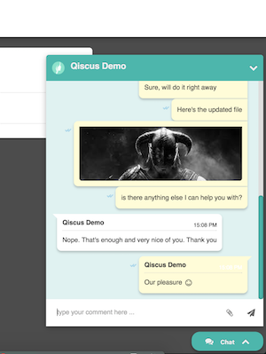

# Qiscus SDK





**Qis**cus SDK helps you build Web Chat Application easy and fast. It uses **qis**cus server backend for the API.
There's two version of the SDK. The SDK Core Only version which you can use to build a custom chat app without opinionated view layer.

# Quick Start
### Create a new SDK application in the Dashboard and get app_id 
You can get `AppId` by requesting one from [sdk.qiscus.com](http://sdk.qiscus.com)

### When integrating SDK with an existing app 
###### SDK with Integrated Widget View

This version let you add a chat widget directly into your existing HTML web pages. 
You just need to include the javascript and css files from the build directory. 
And you also need to append `<div id="qiscus-widget"></div>` tag before closing body tag. Here's sample HTML:

``` html
<html lang="en">
<head>
  <meta charset="UTF-8">
  <title>Document</title>
  <link rel=stylesheet href=https://maxcdn.bootstrapcdn.com/font-awesome/4.6.3/css/font-awesome.min.css>
  <link rel="stylesheet" type="text/css" href="https://s3-ap-southeast-1.amazonaws.com/qiscus-sdk/web/v1.5.0/css/qiscus-sdk.1.5.0.css">
  <!-- add this CDN for emojione if you intend to support emoji -->
  <script src="https://cdnjs.cloudflare.com/ajax/libs/emojione/2.2.7/lib/js/emojione.min.js"></script>
</head>
<body>
  <div id="qiscus-widget"></div>
  <script src="https://s3-ap-southeast-1.amazonaws.com/qiscus-sdk/web/v1.5.0/js/qiscus-sdk.1.5.0.js"></script>
  <script>
     qiscus.setUser('guest@qiscus.com', 'password', 'Qiscus Demo');
     qiscus.init({
        AppId: 'DRAGONGO',
        options: {
              loginSuccessCallback(data) { qiscus.UI.chatTarget('guest2@qiscus.com') },
              newMessagesCallback(data) { console.log("new message : ", data) }
        }
     });
  </script>
</body>
</html>
```

Example Demo App [qiscus-sdk-web.herokuapp.com](http://qiscus-sdk-web.herokuapp.com)


# Authentication 
### Initializing with APP_ID 
The javascript file introduce a new global variable called `qiscus`. We'll use that to initiate our chat widget.

``` javascript
     qiscus.init({
        AppId: 'DRAGONGO',
        options: {
              loginSuccessCallback(data) { },
              newMessagesCallback(data) { }
        }
     });

```
### Login or register
``` javascript
     qiscus.setUser('guest@qiscus.com', 'password', 'Qiscus Demo');
```

### Updating a User Profile and Avatar 
```javascript
     qiscus.setUser('guest@qiscus.com', 'password', 'Qiscus Demo', 'https://imageurl.com/image.png');
```

# 1-to-1 Chat 
### Creating and starting 1-to-1 chat
```javascript
  qiscus.UI.chatTarget('guest2@qiscus.com')
```

# Miscellaneous 
# Change Log 


